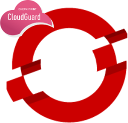
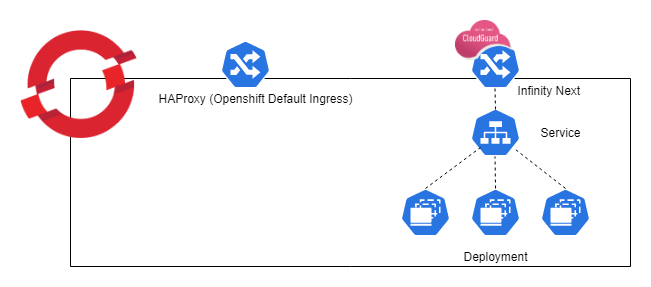
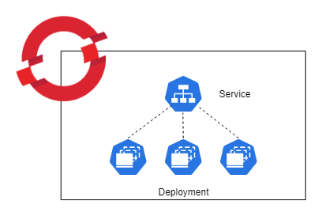

# Helm Chart for Check Point CloudGuard AppSec on Openshift
## Overview


Check Point CloudGuard AppSec delivers access control and advanced threat prevention including web and api protection for mission-critical assets.  Check Point CloudGuard AppSec delivers advanced, multi-layered threat prevention to protect customer assets in Kubernetes clusters from web attacks and sophisticated threats based on Contextual AI.

Helm charts provide the ability to deploy a collection of kubernetes services and containers with a single command. This helm chart deploys an Nginx-based (1.19) ingress controller integrated with the Check Point container images that include and Nginx Reverse Proxy container integrated with the Check Point CloudGuard AppSec nano agent container. It is designed to run in front of your existing Openshift Application. If you want to integrate the Check Point CloudGuard AppSec nano agent with an ingress controller other than Nginx, follow the instructions in the CloudGuard AppSec installation guide. Another option would be to download the helm chart and modify the parameters to match your Openshift/Application environment.

## Architecture

By default, Openshift uses HAProxy as the ingress controller. In this Openshift specific Helm Chart, a parallel Nginx based ingress controller is deployed. This is done to ensure traffic is being inspected by the AppSec nano agent. This Helm Chart blocks prevents traffic from the default HAProxy to the targetted application in order to prevent bypassing the protection. 



The following table lists the configurable parameters of this chart and their default values.

| Parameter                                                  | Description                                                     | Default                                          |
| ---------------------------------------------------------- | --------------------------------------------------------------- | ------------------------------------------------ |
| `nanoToken`                                                | Check Point AppSec nanoToken from the CloudGuard Portal(required)                             |                                           |
| `appURL`                                           | URL of the application (must resolve to cluster IP address after deployment,required)     |                                           |
| `mysvcname`                                           | K8s service name of your application(required)     |                          |
| `mysvcport`                                           | K8s listening port of your service(required)     |                      |
| `operatorServiceAccount`                                            | Openshift Service Account Name (required, please see instructions for permissions)| `cpappsec-sa`                                            | 
| `cpappsecnginxingress.properties.imageRepo`                                             | Dockerhub location of the nginx image integrated with Check Point AppSec                     |                                              |
| `cpappsecnginxingress.properties.imageTag`                                             | Image Version to use                    | `0.1.148370`                                              |
| `cpappsecnanoagent.properties.imageRepo`                                              | Dockerhub location of the Check Point nano agent image              | `checkpoint/infinity-next-nano-agent`                                           |
| `cpappsecnanoagent.properties.imageTag`                                              | Version to use              | `0.1.148370`                                           |
| `TLS_CERTIFICATE_CRT`                                           | Default TLS Certificate               | `Certificate string`                         |
| `TLS_CERTIFICATE_KEY`                                           | Default TLS Certificate Key               | `Certificate Key string`                         | 

## Prerequisites
*   Properly configured access to a Openshift cluster (helm and oc working)
*   Helm 3.x installed
*   Access to a repository that contains the Check Point Infinity-Next-Nginx controller and Infinity-Next-Nano-Agent images
*   An account in portal.checkpoint.com with access to CloudGuard AppSec

## Description of Helm Chart components
*   _Chart.yaml_ \- the basic definition of the helm chart being created. Includes helm chart type, version number, and application version number 
*   _values.yaml_ \- the default application values (variables) to be applied when installing the helm chart. In this case, the CP AppSec nano agent token ID, the image repository locations, the type of ingress service being used and the ports, and specific application specifications can be defined in this file. These values can be manually overridden when launching the helm chart from the command line as shown in the example below.
*   _waap-scc.yaml_ \- the SCC required for the Openshift Service account.
*   _templates/configmap.yaml_ \- configuration information for Nginx.
*   _templates/customresourcedefinition.yaml_ \- CustomResourceDefinitions for the ingress controller.
*   _templates/clusterrole.yaml_ \- specifications of the ClusterRole and ClusterRoleBinding role-based access control (rbac) components for the ingress controller.
*   _ingress-deploy-nano.yaml_ \- container specifications that pull the nginx image that contains the references to the CP Nano Agent.
*   _templates/ingress.yaml_ \- specification for the ingress settings for the application that point to your inbound service.
*   _templates/secrets.yaml_ \- secrets file.
*   _templates/service.yaml_ \- specifications for the ingress controller, e.g. LoadBalancer listening on port 80, forwarding to nodePort 30080 of the application 


## Preparing the application
For this implmentation of AppSec to work seamlessly, the deployments service needs be exposed with the <b>"ClusterIP"</b> type.



## Installing Infinity Next
First, start by cloning this repository.

Define your application in the CloudGuard AppSec application of the Check Point Infinity Portal according to the CloudGuard AppSec Deployment Guide section on AppSec (WAAP) Management.

Once the application has been configured in the CloudGuard Portal, retrieve the value for the nanoToken.

### Openshift Configuration

In order to run this on openshift, first create a service account:
```bash 
oc create sa cpappsec-sa
```
Create the the SCC required to run the containers:
```bash
oc create -f appsec-scc.yaml
```
Apply the SCC to the service account:
```bash
oc adm policy add-scc-to-user appsec-scc -z cpappsec-sa
```

### Installing the Helm Chart

```bash
$ helm install <release_name> cpappsec-0.1.2.tgz --namespace="{your namespace}" --set nanoToken="{your AppSec token string here}" --set appURL="{your appURL}" --set mysvcname="{your app Service Name}" --set mysvcport="{your app service port}" --set operatorServiceAccount.name="<service_account_name>" 
```
These are additional optional flags:
```bash
--set operatorServiceAccount.name="{different service account name}"
--set cpappsecnginxingress.properties.imageRepo="{a different repo}"
--set cpappsecnginxingress.properties.imageTag="{a specific tag/version}"
--set cpappsecnanoagent.properties.imageRepo="{a different repo}"
--set cpappsecnanoagent.properties.imageTag="{a specific tag/version}"
--set cpappsecnanoagent.properties.imageTag="{a specific tag/version}"
```
## Uninstalling the Chart
To uninstall/delete the `my-release` deployment:
```bash
$ helm delete my-release -n {your namespace}
```
This command removes all the Kubernetes components associated with the chart and deletes the release.

## Configuration

Refer to [values.yaml](values.yaml) for the full run-down on defaults. These are the Kubernetes directives that map to environment variables for the deployment.

Specify each parameter using the `--set key=value[,key=value]` argument to `helm install`. For example,

```bash
$ helm install my-release checkpoint/cpappsec-0.1.2.tgz --namespace="myns" --set nanoToken="4339fab-..." --set appURL="myapp.mycompany.com" --set mysvcname="myapp" --set mysvcport="8080" 
```
Alternatively, a YAML file that specifies the values for the parameters can be provided while installing the chart. For example,

```bash
$ helm install my-release -f values.yaml checkpoint/cpappsec
```
